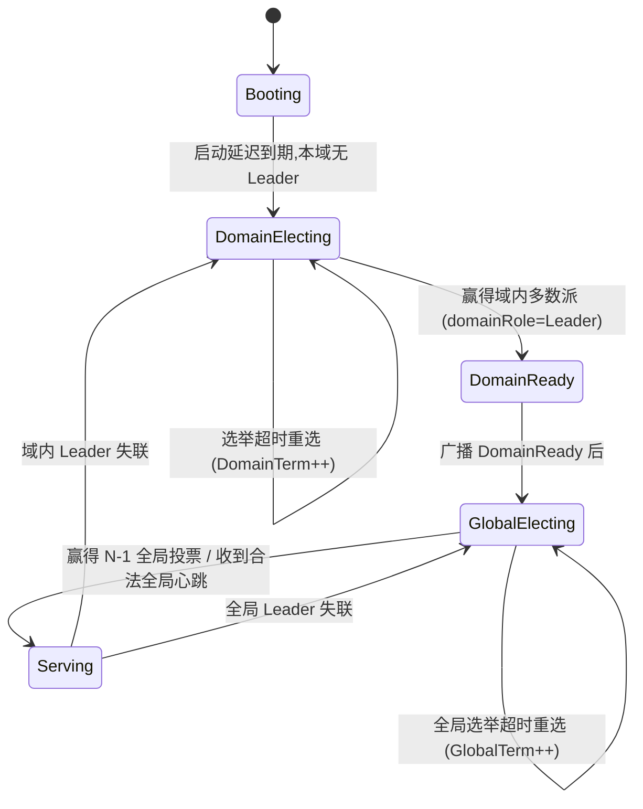
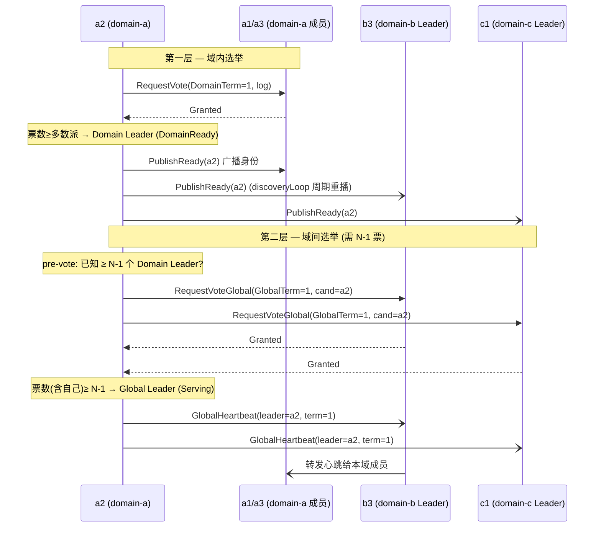
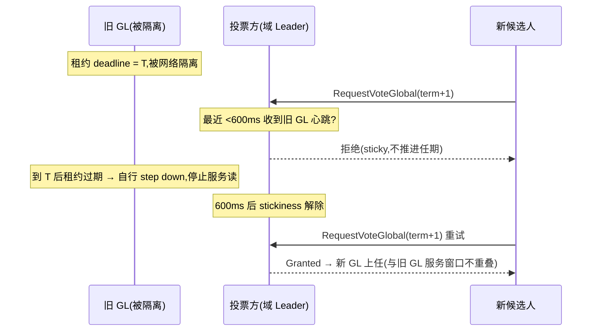

# CD-Raft 架构实现说明

本文基于当前代码(`internal/cdraft/`)讲清楚这些事:

1. **双层 Leader** 是怎么实现的(Domain Leader / Global Leader);
2. **任期**:域内(`DomainTerm`)与域间(`GlobalTerm`)如何区分、如何 fencing;
3. **双层选举**怎么设计(域内多数派 + 域间法定人数);
4. **Fast Return**(快速返回)怎么做的;
5. **唯一 Leader 与线性一致性的安全机制**:法定人数门槛、Leader 读租约、投票方 leader-stickiness、日志冲突截断、RPC 来源/证据校验(见第六节)。

涉及的核心文件:

- `types.go` —— 角色 / 阶段 / 身份 / 任期等类型定义
- `rpc_node.go` —— 节点主体:选举循环、选主、复制、提交、Fast Return
- `consensus.go` —— `appendEntry` / `applyEntry` 等纯状态机逻辑
- `kvstore.go` / `leveldb_store.go` —— 持久化(存储引擎抽象)
- `race.go` / `rpc_client.go` —— 客户端双路响应竞速

---

## 一、总览:两层共识叠在一起

CD-Raft 把一次写入的"定序权"拆成两层:

| 层 | 角色 | 选举范围 | 任期 | 作用 |
|----|------|----------|------|------|
| **域内层(Domain)** | Domain Leader | **单个域内**的节点(如 a1/a2/a3) | `DomainTerm` | 在本域内复制日志、凑域内多数派 |
| **域间层(Global)** | Global Leader | **所有域的 Domain Leader 之间** | `GlobalTerm` | 全局唯一定序者,跨域复制 + 两域提交 |

关键点:

- **Global Leader 本身一定是某个域的 Domain Leader**(`GlobalLeaderIdentity` 内嵌 `DomainLeaderIdentity`)。
- **全局日志**(`LogEntry`)用 `GlobalTerm` + `GlobalIndex` 定序;域内任期只用来在域内选出代表,不参与日志定序。
- 一次写入要拿到 **两个域** 的域内多数派(Global Leader 自己的域 + 至少另一个域)才提交 —— 这就是"two-domain commit"。

每个节点同时持有两套角色,互相独立:

```11:17:internal/cdraft/types.go
const (
	Booting        Stage = "Booting"
	DomainElecting Stage = "DomainElecting"
	DomainReady    Stage = "DomainReady"
	GlobalElecting Stage = "GlobalElecting"
	Serving        Stage = "Serving"
)
```

```41:44:internal/cdraft/rpc_node.go
	domainRole        Role
	globalRole        Role
	domainLeaders     map[string]DomainLeaderIdentity
	globalLeader      GlobalLeaderIdentity
```

节点启动后的阶段推进:



> `Serving` 是唯一能对客户端提供读写的阶段(`Write`/`Read` 都先检查 `n.stage == Serving`)。

---

## 二、任期:域内 vs 域间怎么区分

两个任期是**完全独立的两个单调计数器**,存在持久化状态里:

```11:24:internal/cdraft/store.go
type PersistentState struct {
	DomainTerm             uint64
	DomainVotedFor         string
	DomainLeader           DomainLeaderIdentity
	GlobalTerm             uint64
	GlobalVotedFor         DomainLeaderIdentity
	GlobalLeader           GlobalLeaderIdentity
	...
}
```

身份类型把两层任期编码进去,这是区分的核心:

```77:94:internal/cdraft/types.go
type DomainLeaderIdentity struct {
	DomainID   string
	NodeID     string
	DomainTerm uint64
}

type GlobalLeaderIdentity struct {
	DomainLeader DomainLeaderIdentity
	GlobalTerm   uint64
}
```

| | DomainTerm | GlobalTerm |
|---|---|---|
| 作用域 | 单个域内 | 整个集群 |
| 谁递增 | 域内候选人发起选举时 `DomainTerm++` | Domain Leader 竞选全局时 `GlobalTerm++` |
| 投票记录 | `DomainVotedFor`(节点 ID) | `GlobalVotedFor`(一个 `DomainLeaderIdentity`) |
| 选民 | 同域所有节点 | 所有域的 Domain Leader(每域一票) |
| fencing 点 | `RequestVote` / `Heartbeat` 拒绝更低 `DomainTerm` | `RequestVoteGlobal` / `Replicate` 拒绝更低 `GlobalTerm` |

**fencing(任期围栏)三处**:

- 域内投票:`RequestVote` 中 `request.DomainTerm < state.DomainTerm` 直接拒绝;看到更高任期则降级为 Follower 并清空投票(`rpc_node.go:673-681`)。
- 域间投票:`RequestVoteGlobalInternal` 同理用 `GlobalTerm` 比较;看到更高任期清空全局 leader 与投票(`rpc_node.go:756-762`)。
- 复制:`Replicate` 开头 `request.GlobalTerm < state.GlobalTerm` 拒绝陈旧 leader 的复制(`rpc_node.go:822-826`)。

日志条目只带 **全局** 任期/索引,域内任期不入日志:

```125:132:internal/cdraft/types.go
type LogEntry struct {
	GlobalTerm   uint64
	GlobalIndex  uint64
	RequestID    string
	OriginDomain string
	Command      Command
	Result       string
}
```

> 直觉:`DomainTerm` 解决"谁是这个域当下的代表",`GlobalTerm` 解决"谁是当下全局唯一的定序者"。日志是全局资产,因此只认 `GlobalTerm`。

---

## 三、双层选举设计

### 3.1 第一层:域内选举(标准 Raft 多数派)

`CampaignDomain`(`rpc_node.go:436`):

1. `domainRole = Candidate`,`DomainTerm++`,给自己投票,持久化;
2. 并发向**同域**其他节点发 `RequestVote`(带本地日志 `LogSummary` 做 up-to-date 检查);
3. 票数 ≥ `majority(域内节点数)` → 成为 Domain Leader,`stage = DomainReady`;
4. `publishDomainReady` → 向**全集群所有节点**广播自己的 `DomainLeaderIdentity`(让别的域也认识它),然后进入 `GlobalElecting`。

投票准入(`RequestVote`,`rpc_node.go:682`):未投票或投给同一候选人,且候选人日志 `AtLeast` 本地日志(`LastGlobalTerm` 优先,其次 `LastGlobalIndex`)。

### 3.2 跨域发现:`discoveryLoop`

跨域选举有个先有鸡还是先有蛋的问题:**全局投票处理器会拒绝来自"不认识的候选人"的投票**(`RequestVoteGlobalInternal` 里 `n.domainLeaders[candidate.DomainID] != candidate` 直接拒),全局心跳处理器也会拒绝未知 Global Leader 的心跳。如果只在当选瞬间广播一次(one-shot),先启动的域会永远不被后启动的域发现 → 全局选举卡死,甚至分裂出两个 Global Leader。

所以 Domain Leader **周期性**(每 500ms)重播自己的身份:

```551:569:internal/cdraft/rpc_node.go
func (n *RPCNode) discoveryLoop(ctx context.Context) {
	ticker := time.NewTicker(500 * time.Millisecond)
	...
		if isDomainLeader {
			n.broadcastDomainReady(ctx, identity, summary)
		}
}
```

处理器 `PublishReady` 幂等(用 `DomainTerm` 守卫),重播安全。

### 3.3 第二层:域间选举(N-1 多数派)

只有 Domain Leader 才能竞选 Global Leader。`CampaignGlobal`(`rpc_node.go:571`):

- **Pre-vote guard(预投票守卫)**:必须**已知道 ≥ N-1 个域的 Domain Leader** 才允许发起竞选(并 `GlobalTerm++`)。否则一个先启动、孤身一人的域会无限自增 `GlobalTerm`,污染后续收敛:

```588:598:internal/cdraft/rpc_node.go
	knownLeaders := 0
	for _, id := range n.domainLeaders {
		if id.Valid() {
			knownLeaders++
		}
	}
	if knownLeaders < globalElectionThreshold(len(n.config.Domains())) {
		n.resetGlobalDeadlineLocked()
		n.mu.Unlock()
		return ErrNoGlobalQuorum
	}
```

- 阈值 = **真正的法定人数** `max(N-1, majority(N))`(N 为域数):N≥3 时为 N-1(保留论文的单域容错,且本就是严格多数);N=2 时为 2(两域必须都同意)。这一点很关键——若沿用纯 `N-1`,在 **N=2** 时阈值为 1,两个域会各自只凭自票当选,产生**同任期双 Global Leader(脑裂)**。详见 §6.1。

```196:204:internal/cdraft/types.go
func globalElectionThreshold(domains int) int {
	if domains <= 1 {
		return domains
	}
	if q := majority(domains); domains-1 < q {
		return q
	}
	return domains - 1
}
```

- `GlobalTerm++`,候选人 = 自己的 `DomainLeaderIdentity`,向**所有已知 Domain Leader** 发 `RequestVoteGlobal`(每域一票);
- 票数(含自己)≥ N-1 → 成为 Global Leader,`stage = Serving`,立即发全局心跳。

全局投票准入(`RequestVoteGlobalInternal`,`rpc_node.go:745`):投票人**必须自己是本域 Domain Leader**,且认识候选人这个域的当前 Domain Leader,且 `GlobalTerm` 不旧、日志够新。

全局心跳(`HeartbeatGlobalInternal`,`rpc_node.go:779`):跟随者据此设置 `globalLeader` 并进入 `Serving`;若收方是本域 Domain Leader,还会把心跳**转发给本域成员**(让整个域跟随同一个 GL)。

### 3.4 双层选举时序图



> 健壮性两根支柱(见 `openspec/specs/cd-raft-core/spec.md`):**pre-vote guard** + **周期性跨域发现**。没有它们,错峰启动会让 `GlobalTerm` 无限膨胀或分裂出两个 Global Leader。

---

## 四、写路径 + 两域提交

### 4.1 入口与重定向

客户端可以连任意节点;非 Global Leader 会返回 `RedirectAddress` 指向 GL(`Write`,`rpc_node.go:949-961`)。客户端缓存该地址,后续直连 GL(`rpc_client.go` 的 `lastLeader`)。

Global Leader 收到写:

1. 幂等检查:`requestId` 已结算就直接返回缓存结果(`Results`),复用不同命令则报错;
2. 追加日志条目(`GlobalTerm` + `GlobalIndex = lastIndex+1`),持久化;
3. **在后台 context 上**启动 `replicateAndCommit`(关键设计,见下),用客户端 `ctx` 只决定"何时回话"。

### 4.2 为什么提交跑在后台 context

Fast Return 开启时,origin 域的 Domain Leader 会在它**自己**拿到域内多数派 + GL 域 announce 后就抢答客户端;短命客户端拿到 Fast 响应就退出、`cancel` 掉这次 Write 的 `ctx`。如果提交逻辑绑在这个 `ctx` 上,GL 还没凑齐"第二个域"的证据就被取消,条目会**永远悬而不提交**,把后续线性化读卡在读屏障后面。

所以提交跑在 `context.WithTimeout(context.Background(), commitBudget)` 上,与客户端生死无关;`done` 通道在"两域提交达成"时关闭,用来释放还在等 GlobalResponse 的客户端:

```1016:1037:internal/cdraft/rpc_node.go
	done, ok := n.committing[request.GetRequestId()]
	if !ok {
		done = make(chan struct{})
		n.committing[request.GetRequestId()] = done
		commitCtx, commitCancel := context.WithTimeout(context.Background(), commitBudget(n.rpcPolicy))
		go func() {
			defer commitCancel()
			n.replicateAndCommit(commitCtx, entry, request, globalDomain, done)
			...
		}()
	}
	n.mu.Unlock()
	select {
	case <-ctx.Done():
		return nil, status.Error(codes.DeadlineExceeded, ...)
	case <-done:
	}
```

### 4.3 跨域复制与两域提交

`replicateAndCommit`(`rpc_node.go:1059`)对**每个域的 Domain Leader** 并发跑 `replicateDomainQuorum`:

- 给目标域 Leader 发 `Replicate(FanoutToDomain=true)`,该 Leader 再扇出给本域成员,凑到**域内多数派**就算这个域 quorum;
- 若目标域落后(日志有缺口被拒),触发 `CatchUp` **回填缺失的连续尾巴**后再 ack(落后域追平复制,`rpc_node.go:1143`)。

一旦满足 **GL 自己的域 quorum + 至少另一个域 quorum**,立刻 `commitAcrossDomains`(广播 `CommitNotice`,各域 apply),并关闭 `done`:

```1097:1110:internal/cdraft/rpc_node.go
			if n.fastReturnIsEnabled() && quorums[globalDomain] && !announced && request.GetOriginDomain() != globalDomain {
				announced = true
				go n.announceGlobalDomainQuorum(context.Background(), entry, request.GetReplyRoute())
			}
			if !signaled && quorums[globalDomain] && hasOtherDomainQuorum(quorums, globalDomain) {
				n.commitAcrossDomains(ctx, entry, quorums)
				...
				signal()
			}
```

apply 逻辑(`Commit` handler → `applyEntry`)把连续提交的条目写入状态机并推进 `AppliedIndex`。

### 4.4 读与读屏障

线性化读只由 Global Leader 服务(`Read`,`rpc_node.go:1183`),且要过**读屏障**:GL 自己域的 `DomainQuorumIndex` 这个高水位,必须 ≤ 已提交且已 apply 的位置,否则返回 `ErrReadBarrier`:

```1206:1211:internal/cdraft/rpc_node.go
	barrier := n.state.DomainQuorumIndex[n.local.DomainCode]
	if n.state.KnownGlobalCommitIndex < barrier || n.state.AppliedIndex < barrier {
		n.recordRejectionLocked("read_barrier")
		return nil, status.Error(codes.Unavailable, ErrReadBarrier.Error())
	}
	return &cdraftv1.ClientReadResponse{Value: n.state.StateMachine[request.GetKey()]}, nil
```

---

## 五、Fast Return(快速返回)

### 5.1 思路

普通写要等 Global Leader 凑齐两域证据(可能跨越较远的链路)才回话。Fast Return 让 **origin 域(发起方所在域)的 Domain Leader** 在本地证据足够时**直接抢答客户端**,省掉一次远程 RTT。它与旧实现的区别在于:**不是客户端去轮询,而是 Domain Leader 主动 push 到客户端的回调服务**,并与 Global Leader 的正常响应**赛跑**,谁先到用谁,且两路结果必须一致。

### 5.2 服务端:announce + deliver

触发条件:`fastReturnEnabled` 且 **GL 自己的域已 quorum** 且 **origin 域 ≠ GL 域**(同域无需快返)。

- GL 调 `announceGlobalDomainQuorum` → 给 origin 域 Leader 发 `GlobalDomainQuorumAck`(带 `RequestID`/`Result`/`ReplyRoute`);
- origin 域 Leader 在 `AnnounceGlobalDomainQuorum` 里把它记成 `pendingFast`;
- **两个条件都满足**就投递:① 本域已 quorum 到该 index(`DomainQuorumIndex >= GlobalIndex`)且条目身份匹配,② 连续性 `KnownGlobalCommitIndex+1 >= GlobalIndex`。如果 responder 此时同时握有 GL 域 announce 和本域 quorum,它会先用这份两域**连续前缀证据**调用 `advanceCommitLocked` 把 `KnownGlobalCommitIndex` 推进到目标 index,再复检连续性并触发 `deliverFastReturn`。这两个条件可能由 announce 先到、也可能由本域 `Replicate` 的 quorum 先到:

```text
if localQuorum && pending/announce identity matches:
    advanceCommitLocked(globalIndex, globalTerm, requestId)

if localQuorum && KnownGlobalCommitIndex + 1 >= globalIndex:
    deliverFastReturn(pending)
```

`deliverFastReturn`(`rpc_node.go:1276`)再次校验高水位/连续性/任期,用 `fastSent[requestID]` 去重(只发一次),然后**主动连接客户端的 `ReplyRoute`**,调用客户端侧的 `ClientCallback.FastReturn` 把结果推过去。即使这条 ACK 丢了,GL 仍可靠别的域的 ACK 完成全局提交(两者解耦)。

> 回调连接走节点既有的按地址复用连接池 `n.connection(ReplyRoute)`(`rpc_node.go:2386`),**不再每次回调新建/关闭 gRPC 连接**。否则 `grpc.NewClient` 惰性建链会让每条 Fast Return 的首个 RPC 现场付一次 TCP+HTTP/2 握手,其方差在"GL 临近 origin 域、FR 领先余量很薄"时(如 GL 在北京、写上海)足以随机翻盘成 global-leader 直返。复用长连接后连续 FR 不再承担握手抖动;回调失败也保留连接,由 gRPC 自动重连下次复用。

> 注意 `DomainQuorumIndex` 的更新是 `max(...)` 无条件抬升(`rpc_node.go:879`):因为日志严格 append-only,到达某 index 的域必然持有 1..index 全部条目;早期"+1 才更新"的写法会在 ACK 乱序到达时**永久卡死**该域的快返。

> 连续性闸门 `KnownGlobalCommitIndex+1 >= GlobalIndex` 不再仅靠 GL 异步、滞后的 `CommitNotice` 推进:当 responder 同时握有两域证据(announce 证明 GL 域已 quorum 持有 `1..GlobalIndex`,本域 `DomainQuorumIndex` 也已 quorum 持有同一前缀)时,它依据这份自洽证据用 `advanceCommitLocked` 直接按连续索引推进自己的 `KnownGlobalCommitIndex`(announce 先到、或本域 quorum 先到两条路径都会推进)。因此如果日志为 `k1,k2,k3`,而 `k3` 先在 responder 域形成可快返证据,这份证据提交的是 `k1..k3` 整个连续前缀,不是跳过 `k1/k2` 单独提交 `k3`。`k1/k2` 即使没有赢得 Fast Return,也会因为结果缓存被前缀提交填充而通过 Global Leader 正常响应完成。推进仍严格按索引连续 + 身份校验,真实空洞不会被跨越。

### 5.3 客户端:双路竞速

客户端 `Write`(`rpc_client.go:105`)同时:

- 起一个 goroutine 走正常 unary 调用到 GL(`global` 通道);
- 用一个**常驻回调 gRPC 服务**接收 Domain Leader push 来的 Fast 响应(`fast` 通道,按 `requestId` 路由)。

`RaceResponses`(`race.go:35`)选先到的合法响应为 winner;`drainLate` 继续等另一路,若另一路也合法但**决策不一致**(`SameDecision` 为假)则报 `ErrInconsistentResult` —— 这是 Fast 与 Global 两路的一致性校验。

### 5.4 Fast Return 全链路时序

```mermaid
sequenceDiagram
    autonumber
    participant C as Client (域b, 带回调服务)
    participant GLa as Global Leader (a2, 域a)
    participant DLb as Domain Leader (b3, 域b = origin)
    participant Mem as 各域成员

    C->>GLa: Write(reqId, replyRoute=C回调地址)
    GLa->>GLa: 追加日志, 后台启动 replicateAndCommit
    par 复制到各域 (并发)
        GLa->>GLa: 域a 内部多数派 → quorum[a]
        GLa->>DLb: Replicate(FanoutToDomain) → 域b 多数派 → quorum[b]
    end

    Note over GLa: quorum[a] 达成 且 origin(b)≠a
    GLa-)DLb: AnnounceGlobalDomainQuorum(reqId, result, replyRoute)
    Note over DLb: 记 pendingFast; 本域已 quorum 且连续?
    DLb-)C: ClientCallback.FastReturn(result)  ← Fast 路径(抢答)

    Note over GLa: quorum[a] + 另一个域 quorum → 两域提交
    GLa-)Mem: CommitNotice (各域 apply)
    GLa-->>C: Write 返回 (GlobalResponse)  ← Global 路径

    Note over C: RaceResponses: 取先到者为 winner
    Note over C: drainLate: 校验两路 SameDecision 一致
```

---

## 六、唯一 Leader 与线性一致性的安全机制

前面五节描述的是"正常路径"。本节集中说明那些**只在故障/分区/错峰/重启下才显形**的安全机制——它们共同保证:同一全局任期内不会出现两个 Global Leader、不会读到陈旧值、不会覆盖已提交日志、覆盖未提交分叉后会正确回退多数派证书并落盘、不会接受伪造的复制/提交/迁移,且漏收提交通知的节点仍能靠心跳推进(活性)。

### 6.1 法定人数门槛:杜绝同任期双 Global Leader(脑裂)

全局选举阈值必须是**真正的法定人数**,否则在 **N=2** 域时会脑裂:两个域各自只凭自票(1 票)即可在同一 `GlobalTerm` 当选,产生两个 Global Leader。

修正后的阈值是 `max(N-1, majority(N))`(`types.go:globalElectionThreshold`),它在三个地方同时把关——**发起竞选(pre-vote)、判定当选、确认在任 GL 仍持有法定人数**:

| N(域数) | `N-1` | `majority(N)` | 采用阈值 | 含义 |
|---|---|---|---|---|
| 2 | 1 | 2 | **2** | 两域必须都同意(堵住脑裂) |
| 3 | 2 | 2 | 2 | 容忍 1 个域整体故障 |
| 4 | 3 | 3 | 3 | 容忍 1 个域 |
| 5 | 4 | 3 | 4 | 沿用论文 N-1 |

> 不变式:`2 * globalElectionThreshold(N) > N`(由 `quorum_test.go` 守卫)。两个互不相交的域集合不可能都达到这个阈值,因此同任期至多一个 Global Leader。

### 6.2 Leader 读租约:给陈旧读一个时间上界

线性化读只由 Global Leader 服务。但一个被网络隔离、尚不自知失联的旧 GL,仍可能用本地状态回答读请求,从而返回陈旧值。**读租约(Leader Lease)** 给这个窗口一个硬上界:

- GL 每轮心跳收集到一个**域间法定人数**的 ack 后,就把 `globalLeaseDeadline` 续约 `globalLeaseDuration`(默认 400ms);
- `servesAsGlobalLeaderLocked` 在每次读/写前检查租约是否仍然有效,过期则不再服务:

```1702:1710:internal/cdraft/rpc_node.go
func (n *RPCNode) servesAsGlobalLeaderLocked() bool {
	if n.globalRole != Leader || n.globalLeader.DomainLeader.NodeID != n.local.ID {
		return false
	}
	if n.globalLeaseEnabled && !time.Now().Before(n.globalLeaseDeadline) {
		return false
	}
	return true
}
```

- 故障检测循环在租约过期时主动让 GL 下台,避免它继续"自以为是 Leader":

```1684:1697:internal/cdraft/rpc_node.go
func (n *RPCNode) maybeStepDownExpiredGlobalLeaseLocked(now time.Time) bool {
	if !(n.globalLeaseEnabled && n.globalRole == Leader &&
		n.globalLeader.DomainLeader.NodeID == n.local.ID &&
		now.After(n.globalLeaseDeadline)) {
		return false
	}
	n.globalRole = Follower
	n.globalLeader = GlobalLeaderIdentity{}
	n.state.GlobalLeader = GlobalLeaderIdentity{}
	n.stage = GlobalElecting
	n.resetGlobalDeadlineLocked()
	n.recordRejectionLocked("global_lease_expired")
	return true
}
```

> 租约只**界定**陈旧读的时间窗,真正把窗口压到 0 的是下面的 stickiness:只要旧 Leader 的租约还没过期,新 Leader 就选不出来。

### 6.3 投票方 leader-stickiness + leadership-transfer:闭合租约重叠窗口

光有租约还不够:如果新 Leader 能在旧 Leader 租约**尚未过期**时就当选,两者就会短暂重叠,旧 Leader 仍可能回陈旧读。**leader-stickiness**(Raft 论文 §9.6)让投票方在"最近还听到过合法 GL 的心跳"时,**拒绝任何竞争性投票——哪怕对方任期更高,且不推进自己的任期**:

```833:839:internal/cdraft/rpc_node.go
	if !request.GetLeadershipTransfer() &&
		n.globalLeader.Valid() &&
		n.globalLeader.DomainLeader != candidate &&
		time.Since(n.lastGlobalContact) < globalStickyWindow {
		n.recordRejectionLocked("global_vote_sticky")
		return &cdraftv1.GlobalVoteResponse{GlobalTerm: n.state.GlobalTerm, Voter: toPBDomainIdentity(selfIdentity)}, nil
	}
```

`globalStickyWindow`(600ms)≥ 租约时长,保证新 Leader 必须等旧 Leader 租约确实失效后才可能集齐选票,**两个 Leader 的服务窗口因此不相交**。

但 stickiness 会误伤**主动迁移**:GL 迁移(`beginMigration`)时是在任 Leader 故意让位,不该被 stickiness 挡住。为此在投票请求里加了 `leadership_transfer` 标志——迁移发起的竞选走 `campaignGlobal(ctx, true)`,该标志让投票方**跳过 stickiness 检查**,迁移得以即时完成。注意这个"豁免权"必须被严格看守:`BeginMigration` 处理端会校验请求确实来自当前在任 GL(见 §6.5),否则陈旧/伪造的迁移请求就能滥用 transfer 标志绕过 stickiness。



### 6.4 日志冲突截断:补回 Raft 的 log-matching

旧实现的复制是纯 append-only,缺少 Raft 的 prevLog 一致性检查,分区愈合后可能出现两条分叉日志而无人截断。现在 `ReplicateEntry` 携带 `prev_log_index` / `prev_log_term`,接收方用 `appendEntryChecked` 强制执行 log-matching:

```324:354:internal/cdraft/consensus.go
func appendEntryChecked(state *PersistentState, entry LogEntry, prevIndex, prevTerm uint64) appendOutcome {
	if prevIndex > 0 {
		prev, ok := findEntryByIndex(state.Log, prevIndex)
		if !ok || prev.GlobalTerm != prevTerm {
			return appendPrefixMismatch
		}
	}
	if existing, ok := findEntryByIndex(state.Log, entry.GlobalIndex); ok {
		if existing.GlobalTerm == entry.GlobalTerm && existing.RequestID == entry.RequestID {
			return appendAccepted
		}
		if entry.GlobalIndex <= state.KnownGlobalCommitIndex {
			return appendCommittedConflict
		}
		// Truncate the divergent uncommitted tail, then append the leader's entry.
		state.Log = append(state.Log[:entry.GlobalIndex-1:entry.GlobalIndex-1], entry)
		rollbackQuorumAbove(state, entry.GlobalIndex-1) // §6.4.1
		return appendAccepted
	}
	if entry.GlobalIndex != uint64(len(state.Log))+1 {
		return appendPrefixMismatch
	}
	state.Log = append(state.Log, entry)
	return appendAccepted
}
```

三种结果:

- **`appendAccepted`**:幂等命中、截断未提交分叉后覆盖、或连续追加;
- **`appendPrefixMismatch`**:前驱缺失/分叉 → 触发 `CatchUp` 从 GL 回填连续尾巴(`collectTailEntries` 现也回填 prevLog);
- **`appendCommittedConflict`**:会覆盖**已提交**条目 → 在单任期单 Leader 协议下绝不该发生,直接报硬错误而非默默改写。

#### 6.4.1 覆盖后回退域多数派证书(否则会错误两域提交)

截断只改日志还不够。`DomainQuorumIndex[域]` 是"该域已达成域内多数派的最高索引"高水位,**正常 append-only 时单调安全**;但一旦某索引被覆盖,旧条目在该索引挣得的多数派对**新条目**不再有效。若不回退,会出现:

1. 域 B 多数派持有旧条目 X(`DomainQuorumIndex[B] = i`);
2. B 的 Domain Leader 把索引 `i` 覆盖为 Y,但 followers 仍持有 X;
3. 高水位仍是 `i` → GL/快返逻辑把 B 误判为"已多数派持有 Y" → **错误地两域提交或 Fast Return Y**。

修复:覆盖时调用 `rollbackQuorumAbove(state, GlobalIndex-1)`,把所有 ≥ 被覆盖索引的域多数派水位回退到该索引之下,**新条目必须重新挣得多数派才会被算数**:

```356:366:internal/cdraft/consensus.go
// rollbackQuorumAbove lowers every per-domain quorum high-water mark that sits
// above ceiling back down to ceiling. It is invoked after an uncommitted tail is
// overwritten so the leader never treats a replaced index as still
// quorum-backed.
func rollbackQuorumAbove(state *PersistentState, ceiling uint64) {
	for domain, idx := range state.DomainQuorumIndex {
		if idx > ceiling {
			state.DomainQuorumIndex[domain] = ceiling
		}
	}
}
```

> 回归:`TestAppendEntryCheckedOverwriteRollsBackDomainQuorum`。

#### 6.4.2 覆盖必须真正落盘(否则重启复活旧分叉)

持久化层(`KVStore.Save`)早期假设日志**严格 append-only**,只写 `lastLogLen` 之后的新条目。但原地覆盖**尾部**条目时日志长度不变,旧写法会**跳过**替换条目 → LevelDB 里仍是旧条目 → 重启 `Load` 后旧分叉复活。

修复:把 `lastLogLen int` 换成**逐槽指纹** `lastLog []logFingerprint{index, term, req}`,`Save` 逐索引与磁盘指纹对比,**追加与原地覆盖都会刷盘**,尾部缩短时删除多余 key:

```go
for i := range state.Log {
    if i < len(s.lastLog) && s.lastLog[i] == fingerprintOf(state.Log[i]) {
        continue // unchanged slot, already durable
    }
    // ... marshal + Put logKey(GlobalIndex) ...
}
```

> 回归:`TestKVStorePersistsInPlaceOverwrite`。

### 6.5 RPC 来源 / 任期 / 证据校验:纵深防御

复制类 RPC 不再无条件信任调用方。三处入口都做了任期 + 来源(+ 证据)校验:

- **`Replicate`**:拒绝更低 `GlobalTerm`;同任期下要求 `sender_node_id` 是"我所跟随的 GL,或本域 Domain Leader 在域内扇出"(`replicationSenderTrustedLocked`,`rpc_node.go:905`),否则拒绝。
- **`AnnounceGlobalDomainQuorum`**:校验任期与 announce 所属 GL 域,防止伪造的快返 announce。
- **`CatchUp`**(迁移/落后域回填):要求节点**当前确实跟随某个合法 GL**,且**拒绝任期高于所跟随 GL 的条目**(`entry.GlobalTerm > glTerm` 即拒),防止未鉴权调用方借回填注入未来任期条目。残留:`CatchUp` RPC 仍无加密级 sender 鉴权,但配合 prevLog 匹配 + 任期上界,注入面已显著收窄。
- **`BeginMigration`**(GL 迁移交接):必须验证请求来自**当前在任 GL**——`from_global_term != 0` 且 `== 本节点当前 GlobalTerm` 且本节点确实跟随该任期的合法 GL,否则拒绝。否则一条陈旧/伪造的 `BeginMigration` 就能触发 `campaignGlobal(ctx, true)`,**借 `leadership_transfer` 标志绕过 §6.3 的 stickiness**。这是与 6.3 配套的另一半:transfer 标志的"豁免权"必须绑定到合法在任 GL。
- **`Commit`**:同时校验**任期 + 来源 + 证据**——证据域必须 ≥ 2 个不同域(`distinctDomains(...) < 2` 即拒),否则不认这是合法的两域提交;并且任期 T 的提交通知**不得提交任期 > T 的条目**:

```1060:1084:internal/cdraft/rpc_node.go
	// Stale leader: ignore commit notices from an older global term.
	if request.GetGlobalTerm() < n.state.GlobalTerm {
		return ackStale("commit_stale_term")
	}
	// Provenance: only the Global Leader we follow (or our Domain Leader fanning
	// it out within the domain) may advance our commit index.
	if request.GetGlobalTerm() == n.state.GlobalTerm && !n.replicationSenderTrustedLocked(request.GetSenderNodeId()) {
		return ackStale("commit_bad_sender")
	}
	// Evidence: a legitimate global commit is backed by a two-domain quorum.
	if distinctDomains(request.GetEvidenceDomains()) < 2 {
		return ackStale("commit_insufficient_evidence")
	}
	for next := n.state.KnownGlobalCommitIndex + 1; next <= request.GetCommitIndex(); next++ {
		entry, ok := findEntryByIndex(n.state.Log, next)
		if !ok {
			break
		}
		// A commit notice from term T may never commit an entry created in a
		// newer term than T (it could only be an uncommitted future-term entry
		// that this notice has no authority over).
		if entry.GlobalTerm > request.GetGlobalTerm() {
			break
		}
		applyEntry(&n.state, entry)
	}
```

#### 6.5.1 心跳携带 commit index:漏收 CommitNotice 也能推进(活性)

全局心跳带上了 GL 的 `CommitIndex`,且接收端 `HeartbeatGlobalInternal` 会据此推进:把本地**已持有、且任期不超过 GL** 的连续条目 apply 上去。否则一个漏收了最终 `CommitNotice`(丢包)的节点,在没有后续写入时会长期卡住 apply/commit。来源已随心跳本身校验(`known == leaderIdentity` 且任期不旧),只补一致连续区间:

```go
for next := n.state.KnownGlobalCommitIndex + 1; next <= request.GetCommitIndex(); next++ {
    entry, ok := findEntryByIndex(n.state.Log, next)
    if !ok || entry.GlobalTerm > request.GetGlobalTerm() {
        break
    }
    applyEntry(&n.state, entry)
}
```

### 6.6 客户端迟到 Fast Return 一致性校验

客户端双路竞速时(§5.3),winner 返回后还要让**迟到的另一路**有机会到达,以校验两路 `SameDecision`。这里有个反复踩的坑:回调等待者(Fast 路径)的存活周期**不能**绑在调用方的请求 `ctx` 上——真实 CLI 在 `Write` 返回的瞬间就 `cancel()`,于是 Global 先到时稍晚到达的 Fast Return 仍会被丢弃;而若改用 `context.Background()`,等待者又会永久泄漏。

正确做法分两层:

1. **`drainLate` 跑在独立有界的 detached context 上**(`lateConsistencyGrace`,默认 2s),与调用方 `ctx` 解耦——调用方取消请求不会掐断迟到校验,2s 宽限后也必定收口、不泄漏:

```go
func startLateDrain(requestID string, winner ClientResult, global, fast <-chan Response) <-chan error {
	late := make(chan error, 2)
	go func() {
		ctx, cancel := context.WithTimeout(context.Background(), lateConsistencyGrace)
		defer cancel()
		drainLate(ctx, requestID, winner, global, fast, late)
	}()
	return late
}
```

2. **回调等待者保留到该 detached drain 结束才反注册**(不依赖调用方 ctx,也不泄漏),并把迟到不一致**显式告警**:

```go
late := decision.LateErrors
forwarded := make(chan error, 2)
go func() {
    defer close(forwarded)
    defer router.unregister(request.RequestID)
    for lateErr := range late {
        if errors.Is(lateErr, ErrInconsistentResult) {
            log.Printf("cd-raft client: request %s fast/global results disagree: %v", request.RequestID, lateErr)
        }
        forwarded <- lateErr
    }
}()
decision.LateErrors = forwarded
```

这样无论 Fast 还是 Global 先到,迟到的另一路都能在 2s 宽限内被 `drainLate` 收到并校验,不一致即 `ErrInconsistentResult` 告警——"迟到的快返"真正成为一致性证据,而非被悄悄丢弃。

---

## 七、持久化与存储抽象

共识层只依赖 `Store` 接口(`Load()/Save(PersistentState)`),与具体引擎无关。`Store` 之下再抽象一层 `KVEngine`(`Get/Write/Scan/Close`),由 `KVStore` 实现 `meta`/`log:`/`sm:`/`res:` 的键布局与增量原子写;`leveldbEngine` 是当前默认适配器,换 RocksDB/BoltDB 只需再写一个适配器。

```
共识 (RPCNode/Cluster) → Store 接口 → KVStore(布局/增量) → KVEngine → leveldbEngine ...
```

> 细节见 `internal/cdraft/kvstore.go` 与本仓库 `docker/快速部署测试.md`。

### 日志压缩与快照(snapshot / InstallSnapshot)

每个节点独立地把**已 apply 的日志前缀**折叠进快照:`PersistentState` 记录 `SnapshotLastIndex/Term/RequestID` 三元组(截断点条目的身份),日志切片只保留 `[SnapshotLastIndex+1 ..]`;状态机与 `Results` 幂等缓存本身就是快照数据,无需额外序列化格式。安全性来自"**只压缩 applied 前缀**":applied ≤ commit,已提交条目不可变,其效果完整保留在 `sm:`/`res:` 键空间。

- **触发**:`Features.logCompactionThreshold`(0 = 关闭)/ `logCompactionRetain` 控制自动压缩——applied 超过快照点 threshold 条时折叠,保留最新 retain 条作为 CatchUp 回填的余量;迁移 draining 期间暂停压缩,保证冻结 barrier 的尾部可直接流式传输。也可用 `RPCNode.SetLogCompaction` 在运行时调整。
- **跨截断点的日志匹配**:`prevLogIndex == SnapshotLastIndex` 时用 `SnapshotLastTerm` 校验;选举比较(`Summary()`)在日志为空时回退到快照边界;心跳捎带的 commit 身份在边界条目被压缩后回退到快照元数据。
- **InstallSnapshot**:当落后节点的日志尾低于 GL 的压缩地板(所需条目已被压缩掉)时,`Replication.InstallSnapshot` 把 applied 前缀(状态机 + 幂等缓存 + 边界身份)发给目标 Domain Leader,DL 域内扇出并在过半安装后推进本域 quorum 水位——与 `Replicate` 扇出同构,GL 的 quorum 簿记无需改动;安装后剩余尾部仍走 `CatchUp` 回填。
- **持久化**:`KVStore` 按 `GlobalIndex` 做指纹 diff,压缩在一个原子 batch 内删除被折叠的 `log:` 键;快照元数据随 `meta` 落盘。
- **幂等性**:被压缩条目的重试请求由 `Results` 缓存应答,并用确定性的 result 串校验命令一致性,requestId 重用依旧被拒绝。

---

## 八、各 RPC 服务速查

| service | 方法 | 作用 |
|---------|------|------|
| `DomainElection` | `RequestVote` / `Heartbeat` / `PublishReady` | 域内选举、域内心跳、跨域身份广播 |
| `GlobalElection` | `RequestVote` / `Heartbeat` | 域间选举、全局心跳 |
| `Replication` | `Replicate` / `AnnounceGlobalDomainQuorum` / `Commit` / `InstallSnapshot` | 跨域复制、Fast Return announce、两域提交通知、快照传输(落后于压缩地板的域) |
| `Client` | `Write` / `Read` / `Status` | 客户端写/读、节点状态查询 |
| `ClientCallback` | `FastReturn` | Domain Leader 向客户端 push 快返结果 |
| `Telemetry` | `Ping` / `ReportTelemetry` / `BeginMigration` / `CatchUp` | RTT 探测、遥测上报、迁移、落后域回填 |
| `Metrics` | `Snapshot` | 可观测性指标快照 |
